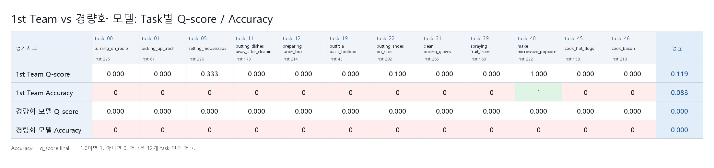
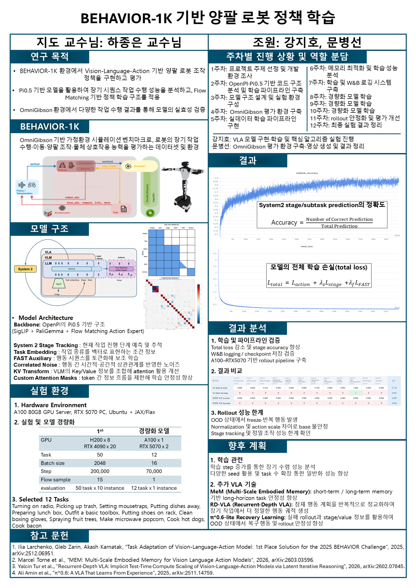

# BEHAVIOR-1K Lightweight Baseline

이 저장소는 2025 BEHAVIOR Challenge 1등팀 코드
[`IliaLarchenko/behavior-1k-solution`](https://github.com/IliaLarchenko/behavior-1k-solution)을
기반으로, 제한된 GPU 환경에서 먼저 검증할 수 있도록 학습 규모를 줄인 BEHAVIOR-1K baseline입니다.

중요한 점은, 1등팀 구조를 새로 해체한 repo가 아니라 **1등팀 baseline에서 학습 규모와 multi-flow sampling 비용을 줄인 실험**이라는 것입니다.

## What Changed

1등팀 reference 대비 이 repo의 핵심 변경은 아래 세 가지입니다.

| 항목 | 1등팀 reference | 이 저장소 lightweight run |
| --- | ---: | ---: |
| Train steps | 200,000 | 70,000 |
| Batch size | 2048 | 16 |
| Multi-flow samples / step | 15 | 1 |

그 외 핵심 구조는 1등팀 코드 흐름을 유지합니다.

- Pi0.5 / OpenPI backbone
- task embedding 기반 conditioning
- System 2 stage / subtask prediction
- flow matching action expert
- correlated noise
- FAST auxiliary loss
- KV transform
- delta action 및 per-timestamp normalization

평가는 현재 12개 selected task와 각 task 1개 instance를 대상으로 정리했습니다. 이는 평가 범위이지, 위 세 가지 변경과 같은 의미의 모델 구조 변경은 아닙니다.

## Main Configs

| Config | 용도 |
| --- | --- |
| `pi_behavior_b1k_baseline` | README 기준 lightweight baseline. 70k steps, batch 16, multi-flow sample 1 |
| `pi_behavior_b1k_a100_baseline_draft` | A100 서버 학습용 동일 baseline 경로 |
| `pi_behavior_b1k_a100_baseline_1000pilot` | 같은 설정의 1000-step pilot |
| `pi_behavior_b1k_smoke` | 짧은 구조 확인용 smoke run |

대표 baseline 조건:

```text
num_train_steps = 70_000
batch_size = 16
num_flow_samples = 1
```

## Evaluation Result

아래 결과는 바탕화면 `평가 결과비교` 폴더에 정리된 12-task 비교 평가를 GitHub용으로 옮긴 것입니다.



| Model | Avg Q-score | Accuracy | 비고 |
| --- | ---: | ---: | --- |
| 1st team reference | 0.119 | 0.083 | 12-task subset 비교 기준 |
| Lightweight baseline | 0.000 | 0.000 | 70k / batch 16 / multi-flow sample 1 |

Accuracy는 `q_score.final == 1.0`이면 1, 아니면 0으로 계산했습니다. 평균은 12개 task 단순 평균입니다.

대표 비교 영상:

**Task 05: setting_mousetraps**

<video src="assets/videos/task_05_setting_mousetraps_296_1st_vs_lightweight.mp4" controls width="720"></video>

[Task 05 video file](assets/videos/task_05_setting_mousetraps_296_1st_vs_lightweight.mp4)

**Task 40: make_microwave_popcorn**

<video src="assets/videos/task_40_make_microwave_popcorn_222_1st_vs_lightweight.mp4" controls width="720"></video>

[Task 40 video file](assets/videos/task_40_make_microwave_popcorn_222_1st_vs_lightweight.mp4)

상세 task별 수치는 [`results/selected12_lightweight_baseline_eval.csv`](results/selected12_lightweight_baseline_eval.csv)에 정리했습니다.

## Capstone Presentation





발표자료는 BEHAVIOR-1K 환경에서 Pi0.5/OpenPI 기반 양팔 로봇 정책을 구현하고, 제한된 GPU 환경에서 경량화 학습과 rollout 평가를 진행한 과정을 한 장짜리 포스터 형식으로 정리한 것입니다. 핵심 비교는 1등팀 대비 `step 200,000 -> 70,000`, `batch size 2048 -> 16`, `flow sample 15 -> 1`로 줄인 lightweight baseline입니다.

## Result Interpretation

이번 결과는 “모델 구조가 완전히 틀렸다”는 결론이라기보다, 1등팀 구조를 유지하더라도 **70k step, batch 16, flow sample 1** 수준으로 줄이면 BEHAVIOR-1K의 긴 조작 task를 안정적으로 완료하기 어렵다는 기준선을 보여줍니다.

관찰된 한계는 다음과 같습니다.

- 70k step은 빠른 baseline으로 의미가 있지만 200k reference보다 학습량이 크게 부족함
- batch 16은 batch 2048 대비 gradient variance가 커질 수 있음
- multi-flow sample을 15에서 1로 줄여 flow matching 학습 신호의 분산이 커질 수 있음
- 한 번 접촉, grasp, button press가 어긋나면 recovery behavior가 약함
- 12 task x 1 instance 평가는 instance 다양성에 취약해 일반화 성능을 충분히 보여주지 못함

따라서 이 저장소의 의미는 낮은 점수 자체가 아니라, 앞으로 학습량과 recovery/memory 쪽을 어디부터 보강해야 하는지 보여주는 출발점입니다.

## Repository Layout

```text
src/b1k/
  models/          PiBehavior 모델 및 모델 설정
  training/        학습 설정, dataloader, checkpoint, weight loader
  policies/        policy 생성, checkpoint switching, inference wrapper
  shared/          normalization, eval wrapper, correction rule

scripts/
  compute_norm_stats.py      normalization 통계 계산
  train_fast_tokenizer.py    FAST tokenizer 학습
  train.py                   PiBehavior policy 학습
  serve_b1k.py               평가용 websocket policy server 실행

assets/
  results/                  README용 평가 이미지
  videos/                   대표 비교 영상
docs/presentation/          compact 중간발표 PPTX 및 preview PNG

BEHAVIOR-1K/                공식 BEHAVIOR-1K / OmniGibson 코드
openpi/                     OpenPI dependency
```

## Installation

권장 환경:

- Linux
- Python 3.11
- CUDA 12.x
- NVIDIA GPU

Clone:

```bash
git clone --recurse-submodules https://github.com/SUN-STAR-HASH/behavior1k.git
cd behavior1k
```

Install:

```bash
bash setup_remote.sh
```

Submodule이 비어 있다면:

```bash
git submodule update --init --recursive
```

## Dataset

기본 config는 resized RGB dataset을 사용합니다.

```text
IliaLarchenko/behavior_224_rgb
```

Download example:

```bash
uv run huggingface-cli login

uv run python - <<'PY'
from huggingface_hub import snapshot_download

snapshot_download(
    repo_id="IliaLarchenko/behavior_224_rgb",
    repo_type="dataset",
    local_dir="./data/behavior_224_rgb",
    local_dir_use_symlinks=False,
)
PY
```

필요하면 `src/b1k/training/config.py`에서 경로를 수정합니다.

```python
behavior_dataset_root="./data/behavior_224_rgb"
assets_base_dir="./outputs/assets"
checkpoint_base_dir="./outputs/checkpoints"
```

## Training

Normalization statistics는 per-timestamp와 correlation을 포함해 계산합니다.

```bash
uv run scripts/compute_norm_stats.py \
  --config-name pi_behavior_b1k_a100_baseline_draft \
  --per-timestamp \
  --correlation
```

FAST auxiliary를 쓰므로 FAST tokenizer도 준비합니다.

```bash
uv run scripts/train_fast_tokenizer.py \
  --config-name pi_behavior_b1k_a100_baseline_draft \
  --encoded-dims="0:6,7:23" \
  --vocab-size=1024
```

70k lightweight baseline:

```bash
uv run scripts/train.py pi_behavior_b1k_a100_baseline_draft --overwrite
```

Resume:

```bash
uv run scripts/train.py pi_behavior_b1k_a100_baseline_draft --resume
```

Weights & Biases logging을 끄려면:

```bash
uv run scripts/train.py pi_behavior_b1k_a100_baseline_draft --wandb_enabled=false
```

## Policy Server

학습된 checkpoint를 websocket policy server로 실행합니다.

```bash
uv run scripts/serve_b1k.py \
  policy:checkpoint \
  --policy.config pi_behavior_b1k_a100_baseline_draft \
  --policy.dir /path/to/checkpoint
```

Task별 checkpoint switching:

```bash
uv run scripts/serve_b1k.py \
  --task-checkpoint-mapping task_checkpoint_mapping.json \
  policy:checkpoint \
  --policy.config pi_behavior_b1k_a100_baseline_draft \
  --policy.dir /path/to/initial/checkpoint
```

## Evaluation

Policy server를 먼저 실행한 뒤, 다른 터미널에서 BEHAVIOR-1K evaluation을 실행합니다.

```bash
python BEHAVIOR-1K/omnigibson/learning/eval.py \
  log_path=./eval_logs \
  policy=websocket \
  model.host=localhost \
  model.port=8000 \
  task.name=make_microwave_popcorn \
  eval_instance_ids="[0]"
```

RTX 5070은 OmniGibson / Isaac Sim 실행과 평가에 사용하고, A100은 JAX 학습에 사용하는 구성을 권장합니다.

## Next Steps

중간발표 PPT의 `향후 계획` 내용을 기준으로 정리했습니다.

### 1. 학습 관련

- 학습 step 증가를 통한 장기 수렴 성능 분석
- 다양한 seed 기반 반복 실험을 통한 모델 재현성 검증
- Task 수 확장을 통한 multi-task generalization 성능 분석

### 2. 추가 VLA 기술

- **MeM (Multi-Scale Embodied Memory)**: short-term / long-term memory 기반 long-horizon task 안정성 향상
- **RD-VLA (Recurrent-Depth VLA)**: latent action plan을 반복적으로 refinement하여 long-horizon task에서 더 정밀한 action trajectory 생성
- **π*0.6-lite Recovery Learning**: 실패 rollout과 stage/value 정보를 활용하여 OOD 상태에서 recovery behavior 및 rollout robustness 향상

PPT의 향후 계획 정리본은 [`docs/improvement_plan.md`](docs/improvement_plan.md)에 따로 두었습니다.

## References

- 1st Place Solution Code: https://github.com/IliaLarchenko/behavior-1k-solution
- BEHAVIOR-1K: https://github.com/StanfordVL/BEHAVIOR-1K
- BEHAVIOR Challenge: https://behavior.stanford.edu/challenge/
- OpenPI: https://github.com/Physical-Intelligence/openpi
- MeM: https://arxiv.org/abs/2603.03596
- RD-VLA: https://arxiv.org/abs/2602.07845
- π*0.6: https://arxiv.org/abs/2511.14759
